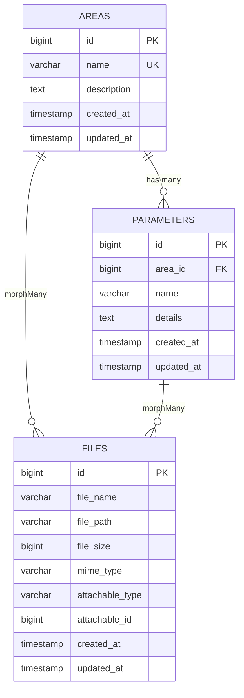
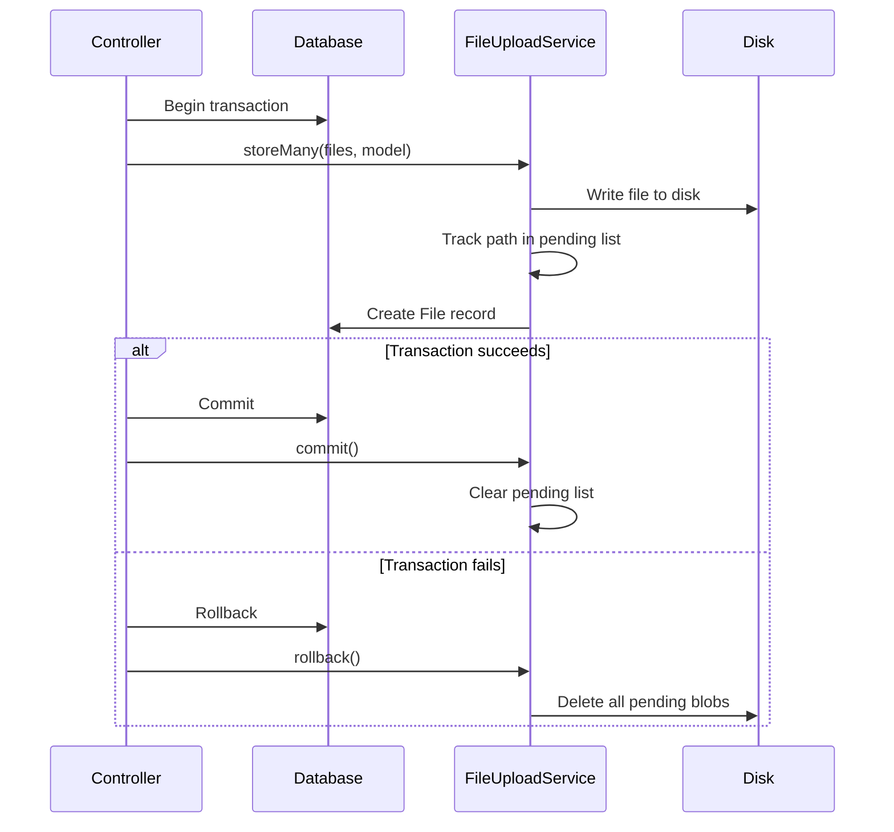

# AREA Backend — Technical Documentation

> **Framework:** Laravel 13 (PHP 8.3+)  
> **Database:** SQLite (default, swappable)  
> **Storage:** `public` disk (local, S3-ready)  
> **Auth:** Stubbed — ready for Sanctum

---

## Table of Contents

1. [Architecture Overview](#1-architecture-overview)
2. [Directory Structure](#2-directory-structure)
3. [Database Schema](#3-database-schema)
4. [Models & Relationships](#4-models--relationships)
5. [API Endpoints](#5-api-endpoints)
6. [Request Validation](#6-request-validation)
7. [API Resources (Response Shapes)](#7-api-resources-response-shapes)
8. [File Upload Service](#8-file-upload-service)
9. [Business Rules & Constraints](#9-business-rules--constraints)
10. [Error Handling](#10-error-handling)
11. [Security](#11-security)
12. [Rate Limiting](#12-rate-limiting)
13. [Configuration & Environment](#13-configuration--environment)
14. [Testing](#14-testing)
15. [Setup & Installation](#15-setup--installation)
16. [Extension Points](#16-extension-points)

---

## 1. Architecture Overview

The backend is a **RESTful JSON API** built with Laravel, managing three core domain entities:

```
Area (max 10) ──┬── Parameter (belongs to Area)
                │
                └── File (polymorphic attachment)
                         ↑
          Parameter ─────┘
```

**Key patterns used:**

| Pattern | Where |
|---|---|
| Form Request validation | All write endpoints |
| API Resources | All JSON responses |
| Service layer | `FileUploadService` for uploads |
| Polymorphic morph map | `files.attachable_type` uses aliases (`area`, `parameter`) |
| Model lifecycle hooks | `creating()`, `deleting()`, `deleted()` |
| Query scopes | `search()`, `sort()` on every model |
| Transactional writes | Every store/update/delete wraps in `DB::transaction()` |

---

## 2. Directory Structure

```
Backend/
├── app/
│   ├── Exceptions/
│   │   └── AreaLimitReachedException.php    # 422 when 10-area ceiling hit
│   ├── Http/
│   │   ├── Controllers/Api/
│   │   │   ├── AreaController.php           # CRUD for areas
│   │   │   ├── ParameterController.php      # CRUD for parameters
│   │   │   └── AttachmentController.php     # List/upload/delete files
│   │   ├── Requests/
│   │   │   ├── IndexAreaRequest.php          # GET /areas query validation
│   │   │   ├── StoreAreaRequest.php          # POST /areas body validation
│   │   │   ├── UpdateAreaRequest.php         # PUT|PATCH /areas/{id}
│   │   │   ├── IndexParameterRequest.php     # GET /areas/{id}/parameters
│   │   │   ├── StoreParameterRequest.php     # POST /areas/{id}/parameters
│   │   │   ├── UpdateParameterRequest.php    # PUT|PATCH /parameters/{id}
│   │   │   └── StoreAttachmentRequest.php    # POST /attachments
│   │   └── Resources/
│   │       ├── AreaResource.php              # Area JSON shape
│   │       ├── ParameterResource.php         # Parameter JSON shape
│   │       └── FileResource.php              # File/attachment JSON shape
│   ├── Models/
│   │   ├── Area.php                          # 10-area limit, search, sort
│   │   ├── Parameter.php                     # Belongs to Area
│   │   ├── File.php                          # Polymorphic attachment
│   │   └── User.php                          # Default Laravel user
│   ├── Providers/
│   │   └── AppServiceProvider.php            # Morph map, rate limiters, N+1 guard
│   ├── Rules/
│   │   └── WithinAreaLimit.php               # Validation rule for 10-area cap
│   ├── Services/
│   │   └── FileUploadService.php             # Upload, commit/rollback disk writes
│   └── Support/
│       └── AttachmentRules.php               # Shared file validation constants
├── database/
│   ├── factories/                            # AreaFactory, ParameterFactory, FileFactory
│   ├── migrations/
│   │   ├── 2025_01_01_000001_create_areas_table.php
│   │   ├── 2025_01_01_000002_create_parameters_table.php
│   │   └── 2025_01_01_000003_create_files_table.php
│   └── seeders/
│       ├── AreaSeeder.php                    # Seeds up to remaining capacity
│       └── DatabaseSeeder.php
├── routes/
│   └── api.php                               # All API route definitions
└── tests/
    └── Feature/
        └── AreaApiTest.php                   # Feature tests for area endpoints
```

---

## 3. Database Schema

### `areas`

| Column | Type | Constraints |
|---|---|---|
| `id` | `bigint` (PK) | Auto-increment |
| `name` | `varchar(255)` | **UNIQUE**, NOT NULL |
| `description` | `text` | NULLABLE |
| `created_at` | `timestamp` | Indexed |
| `updated_at` | `timestamp` | — |

### `parameters`

| Column | Type | Constraints |
|---|---|---|
| `id` | `bigint` (PK) | Auto-increment |
| `area_id` | `bigint` (FK → `areas.id`) | `ON UPDATE CASCADE`, `ON DELETE CASCADE` |
| `name` | `varchar(255)` | NOT NULL |
| `details` | `text` | NULLABLE |
| `created_at` | `timestamp` | Indexed |
| `updated_at` | `timestamp` | — |

**Indexes:** Composite unique on `(area_id, name)`, index on `name`, index on `created_at`.

### `files`

| Column | Type | Constraints |
|---|---|---|
| `id` | `bigint` (PK) | Auto-increment |
| `file_name` | `varchar(255)` | NOT NULL, Indexed |
| `file_path` | `varchar(1024)` | NOT NULL |
| `file_size` | `unsigned bigint` | Default `0` |
| `mime_type` | `varchar(191)` | NULLABLE |
| `attachable_type` | `varchar(255)` | Morph alias (`area` or `parameter`) |
| `attachable_id` | `bigint` | FK to parent's `id` |
| `created_at` | `timestamp` | — |
| `updated_at` | `timestamp` | — |

**Indexes:** Composite index on `(attachable_type, attachable_id)` via `morphs()`, index on `file_name`.

### Entity-Relationship Diagram



---

## 4. Models & Relationships

### `Area` — [Area.php](file:///c:/Users/Christian%20Jay%20Fugen/OneDrive/Desktop/area/Backend/app/Models/Area.php)

| Property | Type |
|---|---|
| `id` | `int` |
| `name` | `string` |
| `description` | `string\|null` |

**Relationships:**

| Method | Type | Target |
|---|---|---|
| `parameters()` | `HasMany` | `Parameter` |
| `files()` | `MorphMany` | `File` |

**Constants:**
- `MAX_AREAS = 10` — system-wide ceiling

**Static methods:**
- `remainingCapacity(): int` — slots left before hitting the limit
- `hasCapacity(): bool` — whether a new area can be created
- `morphAlias(): string` — returns the morph map alias (`"area"`)

**Lifecycle hooks:**
- `creating()` — throws `AreaLimitReachedException` if at capacity
- `deleting()` — cascades deletion through `parameters` and `files` as Eloquent models (not just DB cascade) to trigger `File::deleted()` and clean up blobs

**Query scopes:**
- `scopeSearch(?string $term)` — LIKE search across `areas.name`, `areas.description`, related `parameters.name`, `parameters.details`, and attachment `files.file_name` (uses `whereHas`, not joins)
- `scopeSort(?string $column, ?string $direction)` — whitelisted sorting on `id`, `name`, `created_at`, `updated_at`, `parameters_count`, `files_count`; unknown columns silently fall back to `created_at`

---

### `Parameter` — [Parameter.php](file:///c:/Users/Christian%20Jay%20Fugen/OneDrive/Desktop/area/Backend/app/Models/Parameter.php)

| Property | Type |
|---|---|
| `id` | `int` |
| `area_id` | `int` |
| `name` | `string` |
| `details` | `string\|null` |

**Relationships:**

| Method | Type | Target |
|---|---|---|
| `area()` | `BelongsTo` | `Area` |
| `files()` | `MorphMany` | `File` |

**Lifecycle hooks:**
- `deleting()` — deletes all child `files` as models to trigger disk cleanup

**Query scopes:**
- `scopeSearch(?string $term)` — LIKE on `parameters.name`, `parameters.details`, parent `areas.name`, and attached `files.file_name`
- `scopeSort(?string $column, ?string $direction)` — whitelisted: `id`, `name`, `created_at`, `updated_at`

---

### `File` — [File.php](file:///c:/Users/Christian%20Jay%20Fugen/OneDrive/Desktop/area/Backend/app/Models/File.php)

| Property | Type |
|---|---|
| `id` | `int` |
| `file_name` | `string` |
| `file_path` | `string` |
| `file_size` | `int` (cast) |
| `mime_type` | `string\|null` |
| `attachable_type` | `string` |
| `attachable_id` | `int` |

**Computed attributes (appended):**

| Attribute | Description |
|---|---|
| `url` | Full public URL via `Storage::disk('public')->url()` |
| `human_readable_size` | e.g. `"2.45 MB"` |

**Constants:**
- `DISK = 'public'` — storage disk for all attachments

**Relationships:**

| Method | Type | Target |
|---|---|---|
| `attachable()` | `MorphTo` | `Area` or `Parameter` |

**Lifecycle hooks:**
- `deleted()` — defers blob deletion to `DB::afterCommit()`. If the transaction rolls back, the file stays intact.

**Accessors/mutators:**
- `filePath` (set) — normalises path: strips leading `/`, converts backslashes to forward slashes
- `url` (get) — cached, builds URL via configured storage disk
- `humanReadableSize` (get) — cached, converts bytes to `B`/`KB`/`MB`/`GB`/`TB`

**Storage helpers:**
- `deleteFromDisk(): bool`
- `existsOnDisk(): bool`
- `temporaryUrl(int $minutes = 5): ?string` — for S3; falls back to `$this->url` on local disks

**Query scopes:**
- `scopeSearch(?string $term)` — LIKE on `files.file_name`, `files.mime_type`
- `scopeSort(?string $column, ?string $direction)` — whitelisted: `id`, `file_name`, `file_size`, `mime_type`, `created_at`, `updated_at`

---

## 5. API Endpoints

All endpoints are prefixed with `/api` and wrapped in `throttle:api` middleware.

### Areas

| Method | URI | Controller Action | Description |
|---|---|---|---|
| `GET` | `/api/areas` | `AreaController@index` | List all areas (paginated, searchable, sortable) |
| `POST` | `/api/areas` | `AreaController@store` | Create a new area (optional `files[]`) |
| `GET` | `/api/areas/{area}` | `AreaController@show` | Get a single area with parameters and files |
| `PUT\|PATCH` | `/api/areas/{area}` | `AreaController@update` | Update area fields and/or attach files |
| `DELETE` | `/api/areas/{area}` | `AreaController@destroy` | Delete area + cascade parameters + files |

### Parameters

| Method | URI | Controller Action | Description |
|---|---|---|---|
| `GET` | `/api/areas/{area}/parameters` | `ParameterController@index` | List parameters for an area (paginated) |
| `POST` | `/api/areas/{area}/parameters` | `ParameterController@store` | Create parameter under area (optional `files[]`) |
| `GET` | `/api/parameters/{parameter}` | `ParameterController@show` | Get a single parameter (shallow route) |
| `PUT\|PATCH` | `/api/parameters/{parameter}` | `ParameterController@update` | Update parameter (can reassign `area_id`) |
| `DELETE` | `/api/parameters/{parameter}` | `ParameterController@destroy` | Delete parameter + attached files |

### Attachments

| Method | URI | Controller Action | Description |
|---|---|---|---|
| `GET` | `/api/attachments` | `AttachmentController@index` | List files (filterable by type/id, searchable) |
| `GET` | `/api/attachments/{file}` | `AttachmentController@show` | Get a single attachment |
| `POST` | `/api/attachments` | `AttachmentController@store` | Upload files to any attachable (rate-limited) |
| `DELETE` | `/api/attachments/{file}` | `AttachmentController@destroy` | Delete attachment row + blob on disk |

### Query Parameters for List Endpoints

| Parameter | Type | Default | Description |
|---|---|---|---|
| `search` | `string` | `null` | Free-text search keyword |
| `sort_by` | `string` | `created_at` | Column to sort by (whitelisted per resource) |
| `direction` | `string` | `asc` | Sort direction: `asc` or `desc` |
| `per_page` | `integer` | `15` | Results per page (1–100) |

**Attachment-specific filters:**

| Parameter | Type | Description |
|---|---|---|
| `attachable_type` | `string` | Filter by morph type (`area` or `parameter`) |
| `attachable_id` | `integer` | Filter by parent ID |

### Sortable Columns by Resource

| Resource | Sortable Columns |
|---|---|
| **Areas** | `id`, `name`, `created_at`, `updated_at`, `parameters_count`, `files_count` |
| **Parameters** | `id`, `name`, `created_at`, `updated_at` |
| **Attachments** | `id`, `file_name`, `file_size`, `mime_type`, `created_at`, `updated_at` |

### cURL Examples

```bash
# List areas with search and sorting
curl "http://localhost:8000/api/areas?search=hydraulics&sort_by=name&direction=asc&per_page=10"

# Create an area with file attachments
curl -X POST http://localhost:8000/api/areas \
  -H "Accept: application/json" \
  -F "name=Hydraulics" \
  -F "description=Pump and valve subsystem" \
  -F "files[]=@./spec.pdf"

# Upload files to an existing parameter
curl -X POST http://localhost:8000/api/attachments \
  -H "Accept: application/json" \
  -F "attachable_type=parameter" \
  -F "attachable_id=7" \
  -F "files[]=@./diagram.png" \
  -F "files[]=@./notes.pdf"

# Update area with files (method spoofing for multipart PUT)
curl -X POST http://localhost:8000/api/areas/3 \
  -F "_method=PUT" \
  -F "name=Hydraulics v2" \
  -F "files[]=@./revised.pdf"
```

> [!IMPORTANT]
> PHP does not parse `multipart/form-data` on `PUT` requests. When updating **with files**, use `POST` with `_method=PUT` in the body (Laravel method spoofing).

---

## 6. Request Validation

### [StoreAreaRequest](file:///c:/Users/Christian%20Jay%20Fugen/OneDrive/Desktop/area/Backend/app/Http/Requests/StoreAreaRequest.php)

| Field | Rules |
|---|---|
| `name` | required, string, max:255, unique in `areas`, `WithinAreaLimit` |
| `description` | nullable, string, max:5000 |
| `files` | sometimes, array, max:10 |
| `files.*` | file, max:10240KB, allowed extensions + MIME types |

### [UpdateAreaRequest](file:///c:/Users/Christian%20Jay%20Fugen/OneDrive/Desktop/area/Backend/app/Http/Requests/UpdateAreaRequest.php)

| Field | Rules |
|---|---|
| `name` | sometimes, required, string, max:255, unique (ignoring self) |
| `description` | sometimes, nullable, string, max:5000 |
| `files` | sometimes, array, max:10 |
| `files.*` | file, max:10240KB, allowed extensions + MIME types |

### [IndexAreaRequest](file:///c:/Users/Christian%20Jay%20Fugen/OneDrive/Desktop/area/Backend/app/Http/Requests/IndexAreaRequest.php)

| Field | Rules |
|---|---|
| `search` | nullable, string, max:255 |
| `sort_by` | nullable, string, in: `id`, `name`, `created_at`, `updated_at`, `parameters_count`, `files_count` |
| `direction` | nullable, string, in: `asc`, `desc` |
| `per_page` | nullable, integer, 1–100 |

### [StoreParameterRequest](file:///c:/Users/Christian%20Jay%20Fugen/OneDrive/Desktop/area/Backend/app/Http/Requests/StoreParameterRequest.php)

| Field | Rules |
|---|---|
| `name` | required, string, max:255, unique per area (scoped by `area_id`) |
| `details` | nullable, string, max:10000 |
| `files` | sometimes, array, max:10 |
| `files.*` | file, max:10240KB, allowed extensions + MIME types |

### [UpdateParameterRequest](file:///c:/Users/Christian%20Jay%20Fugen/OneDrive/Desktop/area/Backend/app/Http/Requests/UpdateParameterRequest.php)

| Field | Rules |
|---|---|
| `name` | sometimes, required, string, max:255, unique per area (ignoring self) |
| `details` | sometimes, nullable, string, max:10000 |
| `area_id` | sometimes, required, integer, must exist in `areas` |
| `files` | sometimes, array, max:10 |
| `files.*` | file, max:10240KB, allowed extensions + MIME types |

### [StoreAttachmentRequest](file:///c:/Users/Christian%20Jay%20Fugen/OneDrive/Desktop/area/Backend/app/Http/Requests/StoreAttachmentRequest.php)

| Field | Rules |
|---|---|
| `attachable_type` | required, string, in: `area`, `parameter` |
| `attachable_id` | required, integer, min:1, exists in target table |
| `files` | required, array, min:1, max:10 |
| `files.*` | file, max:10240KB, allowed extensions + MIME types |

**Type normalisation:** The request accepts `"Area"`, `"areas"`, or `"App\Models\Area"` and normalises them all to `"area"`.

### Allowed File Types — [AttachmentRules](file:///c:/Users/Christian%20Jay%20Fugen/OneDrive/Desktop/area/Backend/app/Support/AttachmentRules.php)

| Constraint | Value |
|---|---|
| Max file size | 10 MB (10,240 KB) |
| Max files per request | 10 |
| **Allowed extensions** | `jpg`, `jpeg`, `png`, `webp`, `gif`, `svg`, `pdf`, `doc`, `docx`, `xls`, `xlsx`, `ppt`, `pptx`, `csv`, `txt`, `zip` |
| **Allowed MIME types** | `image/jpeg`, `image/png`, `image/webp`, `image/gif`, `image/svg+xml`, `application/pdf`, `application/msword`, `application/vnd.openxmlformats-officedocument.wordprocessingml.document`, `application/vnd.ms-excel`, `application/vnd.openxmlformats-officedocument.spreadsheetml.sheet`, `application/vnd.ms-powerpoint`, `application/vnd.openxmlformats-officedocument.presentationml.presentation`, `text/csv`, `text/plain`, `application/zip`, `application/x-zip-compressed` |

> [!NOTE]
> Files are validated on **both** extension (`mimes:`) and MIME type (`mimetypes:`). A renamed `.php` file disguised as `.jpg` will fail both checks.

---

## 7. API Resources (Response Shapes)

### AreaResource

```json
{
  "id": 1,
  "name": "Hydraulics",
  "description": "Pump and valve subsystem",
  "created_at": "2025-09-17T12:00:00+00:00",
  "updated_at": "2025-09-17T12:00:00+00:00",
  "parameters_count": 3,
  "files_count": 2,
  "parameters": [ /* ParameterResource[] — only when loaded */ ],
  "files": [ /* FileResource[] — only when loaded */ ]
}
```

> `parameters_count`, `files_count`, `parameters`, and `files` only appear when explicitly loaded by the controller (`whenCounted` / `whenLoaded`).

### ParameterResource

```json
{
  "id": 5,
  "area_id": 1,
  "name": "Flow Rate",
  "details": "Measured in litres per minute",
  "created_at": "2025-09-17T12:00:00+00:00",
  "updated_at": "2025-09-17T12:00:00+00:00",
  "files_count": 1,
  "files": [ /* FileResource[] — only when loaded */ ],
  "area": { /* AreaResource — only when loaded */ }
}
```

### FileResource

```json
{
  "id": 10,
  "file_name": "spec.pdf",
  "file_path": "attachments/areas/2025/09/abcdef123456.pdf",
  "file_size": 204800,
  "human_readable_size": "200 KB",
  "mime_type": "application/pdf",
  "url": "http://localhost:8000/storage/attachments/areas/2025/09/abcdef123456.pdf",
  "attachable_type": "area",
  "attachable_id": 1,
  "created_at": "2025-09-17T12:00:00+00:00",
  "updated_at": "2025-09-17T12:00:00+00:00"
}
```

### List Endpoint Meta (Areas)

The `GET /api/areas` response includes additional metadata:

```json
{
  "data": [ /* AreaResource[] */ ],
  "meta": {
    "max_areas": 10,
    "remaining_slots": 7,
    "filters": {
      "search": "hydraulics",
      "sort_by": "name",
      "direction": "asc"
    },
    "current_page": 1,
    "last_page": 1,
    "per_page": 15,
    "total": 3
  },
  "links": { /* pagination links */ }
}
```

---

## 8. File Upload Service

[FileUploadService](file:///c:/Users/Christian%20Jay%20Fugen/OneDrive/Desktop/area/Backend/app/Services/FileUploadService.php) handles the gap between transactional database writes and non-transactional disk writes.

### Flow



### Methods

| Method | Description |
|---|---|
| `store(UploadedFile, Model): File` | Write one file to disk, create a `File` record attached to the model |
| `storeMany(iterable, Model): Collection` | Store multiple files in sequence |
| `commit(): void` | Clear the pending list — blobs are now permanent |
| `rollback(): void` | Delete all pending blobs from disk |

### Storage Path Convention

Files are stored under: `attachments/{model_plural}/{YYYY}/{MM}/{hash}`

Example: `attachments/areas/2025/09/abc123def456.pdf`

### Filename Safety

- The **original client filename** is stored in `file_name` for display only
- The **stored path** always uses Laravel's hashed name
- Filenames are stripped of directory components and capped at 250 characters

---

## 9. Business Rules & Constraints

### 10-Area Limit

Enforced in **two places** by design:

| Layer | Mechanism | Purpose |
|---|---|---|
| HTTP validation | [WithinAreaLimit](file:///c:/Users/Christian%20Jay%20Fugen/OneDrive/Desktop/area/Backend/app/Rules/WithinAreaLimit.php) rule on `StoreAreaRequest` | Returns a user-friendly 422 to API clients |
| Model hook | `Area::creating()` throws [AreaLimitReachedException](file:///c:/Users/Christian%20Jay%20Fugen/OneDrive/Desktop/area/Backend/app/Exceptions/AreaLimitReachedException.php) | Catches seeders, jobs, tinker, console — anything that bypasses HTTP |

### Cascade Deletes

Deletes are handled through **Eloquent models**, not just database cascades:

- `Area::deleting()` → iterates and deletes each `Parameter` and `File` as models
- `Parameter::deleting()` → iterates and deletes each child `File` as a model
- `File::deleted()` → defers `deleteFromDisk()` via `DB::afterCommit()`

The FK cascade on `parameters.area_id` remains as a safety net for direct SQL.

### Name Uniqueness

| Entity | Scope |
|---|---|
| `areas.name` | Globally unique |
| `parameters.name` | Unique per area (composite unique on `area_id` + `name`) |

### Parameter Reassignment

A parameter can be moved to a different area by sending `area_id` in an update request. The new `area_id` must exist.

---

## 10. Error Handling

### Validation Errors (422)

Standard Laravel validation response:

```json
{
  "message": "The name field is required.",
  "errors": {
    "name": ["The name field is required."]
  }
}
```

### Area Limit Exceeded (422)

Both the validation rule and the exception produce the same shape:

```json
{
  "message": "Cannot create another area: the system limit of 10 areas has been reached.",
  "errors": {
    "name": ["Cannot create another area: the system limit of 10 areas has been reached."]
  }
}
```

### Not Found (404)

Automatic via Laravel route model binding:

```json
{
  "message": "No query results for model [App\\Models\\Area] 999."
}
```

### Delete Success (204)

All delete endpoints return `204 No Content` with an empty body.

### Create Success (201)

All store endpoints return `201 Created` with the created resource.

---

## 11. Security

### Polymorphic Type Safety

- `enforceMorphMap()` in [AppServiceProvider](file:///c:/Users/Christian%20Jay%20Fugen/OneDrive/Desktop/area/Backend/app/Providers/AppServiceProvider.php) maps only `area`, `parameter`, `file` — no arbitrary class names
- `StoreAttachmentRequest::ATTACHABLE_TYPES` is an explicit whitelist: `['area' => Area::class, 'parameter' => Parameter::class]`
- `attachable_id` is validated with `exists` against the resolved type's table

### Upload Security

- **Dual validation:** Both `mimes:` (extension) and `mimetypes:` (actual MIME) are checked
- **No client paths on disk:** Files are stored with Laravel's hashed names
- **Client filename sanitised:** Stripped of directory components, length-capped to 250

### SQL Injection Prevention

- Sort columns use strict whitelists; unknown values silently fall back to `created_at`
- Search terms are escaped with `addcslashes()` before LIKE queries

### N+1 Prevention

`Model::preventLazyLoading()` is enabled outside production — any accidental lazy load throws an exception during development and testing.

### Auth (Stubbed)

- Every `authorize()` returns `true`
- Policy calls are commented out, ready to wire up
- `auth:sanctum` middleware is documented for the route group

---

## 12. Rate Limiting

Defined in [AppServiceProvider::configureRateLimiters()](file:///c:/Users/Christian%20Jay%20Fugen/OneDrive/Desktop/area/Backend/app/Providers/AppServiceProvider.php#L51-L57):

| Limiter | Limit | Applied To |
|---|---|---|
| `api` | 60 requests/minute per user or IP | All API routes |
| `uploads` | 30 requests/minute per user or IP | `POST /api/attachments` only |

---

## 13. Configuration & Environment

### Key `.env` Variables

| Variable | Default | Purpose |
|---|---|---|
| `APP_URL` | `http://127.0.0.1:8000` | Base URL for `Storage::url()` — affects all attachment URLs |
| `DB_CONNECTION` | `sqlite` | Database driver |
| `FILESYSTEM_DISK` | `local` | Default disk (attachments always use `public`) |
| `APP_ENV` | `local` | Controls lazy-loading prevention |
| `APP_DEBUG` | `true` | Detailed error messages |

### Dependencies

| Package | Version | Purpose |
|---|---|---|
| `php` | `^8.3` | Runtime |
| `laravel/framework` | `^13.17` | Core framework |
| `laravel/tinker` | `^3.0` | REPL |
| `phpunit/phpunit` | `^12.5.12` | Testing |
| `fakerphp/faker` | `^1.23` | Factory data |

---

## 14. Testing

### Running Tests

```bash
php artisan test
```

### Test Structure

- [AreaApiTest.php](file:///c:/Users/Christian%20Jay%20Fugen/OneDrive/Desktop/area/Backend/tests/Feature/AreaApiTest.php) — Feature tests for area CRUD endpoints

### Factories

| Factory | Model | Generates |
|---|---|---|
| [AreaFactory](file:///c:/Users/Christian%20Jay%20Fugen/OneDrive/Desktop/area/Backend/database/factories/AreaFactory.php) | `Area` | Unique 2-word name, optional sentence description |
| [ParameterFactory](file:///c:/Users/Christian%20Jay%20Fugen/OneDrive/Desktop/area/Backend/database/factories/ParameterFactory.php) | `Parameter` | Unique 2-word name, optional paragraph details, belongs to Area |
| [FileFactory](file:///c:/Users/Christian%20Jay%20Fugen/OneDrive/Desktop/area/Backend/database/factories/FileFactory.php) | `File` | PDF stub with UUID path, random size 1KB–5MB |

### Seeder

[AreaSeeder](file:///c:/Users/Christian%20Jay%20Fugen/OneDrive/Desktop/area/Backend/database/seeders/AreaSeeder.php) creates areas up to remaining capacity (never exceeds the 10-area ceiling), each with 3 parameters:

```bash
php artisan db:seed --class=Database\\Seeders\\AreaSeeder
```

---

## 15. Setup & Installation

```bash
# 1. Install dependencies
composer install

# 2. Create environment file
cp .env.example .env

# 3. Generate application key
php artisan key:generate

# 4. Create the storage symlink
php artisan storage:link

# 5. Run migrations
php artisan migrate

# 6. (Optional) Seed sample data
php artisan db:seed --class=Database\\Seeders\\AreaSeeder

# 7. Start the development server
php artisan serve
```

The API will be available at `http://127.0.0.1:8000/api`.

---

## 16. Extension Points

These features are deliberately left as hooks for future implementation:

| Feature | Current State | How to Enable |
|---|---|---|
| **Authentication** | Every `authorize()` returns `true` | Add `auth:sanctum` middleware to the route group; swap `authorize()` for policy checks |
| **Soft Deletes** | Physical deletes with disk cleanup | Add `SoftDeletes` trait; move disk cleanup to `forceDeleted` event |
| **Private Files** | All files on `public` disk, publicly accessible | Move to `local` disk; serve via signed controller route |
| **Full-Text Search** | `LIKE` queries with `whereHas` | Add `FULLTEXT` indexes or integrate Scout/Meilisearch |
| **Concurrency Safety** | No locking on area count | Add `lockForUpdate()` count inside transaction, or a database trigger |
| **Name Uniqueness** | `areas.name` globally unique, `parameters.name` per-area | Single-line migration changes to adjust constraints |
